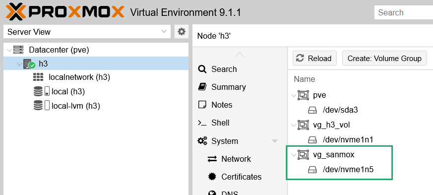
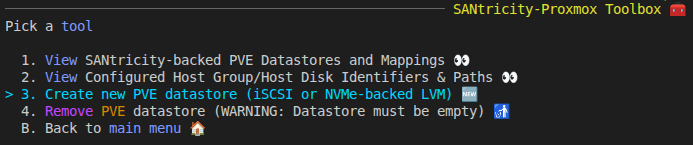

# SANmox - SANtricity - Proxmox VE 9 TUI 

## What is SANmox

Proxmox VE 9 has a poor storage plug-in approach inspired by my SolidFire TUI, [Firemox](https://github.com/scaleoutsean/firemox). See [this post](https://scaleoutsean.github.io/2026/03/31/proxmox-plugin-netapp-eseries-santricity.html) for more on SANmox and SANtricity LVM plug-in for PVE 9.

This TUI has the following advantages:

- Does not require storage credentials on PVE nodes
- API access to PVE - more robust for minor PVE upgrades and patches
- API access to SANtricity and easy to extend as underlying SANtricity PowerShell cmdlets are many
- It can be extended to use SANtricity LVM, my [SANtricity-aware LVM plugin for shared storage](https://scaleoutsean.github.io/2026/03/31/proxmox-plugin-netapp-eseries-santricity.html), without weaker security inherent to full-featured Proxmox VE storage plug-ins

## Installation and configuration

SANmox is **not** meant to be installed on PVE nodes. It is meant to be installed on a management workstation that can reach PVE hosts and SANtricity management IP.

- Assuming your workstation is running Debian Trixie, you should be able to use [PowerShell 7.6 LTS](https://github.com/PowerShell/PowerShell/releases/download/v7.6.0/powershell-lts_7.6.0-1.deb_amd64.deb). If you're on other OS, get a recent PowerShell 7.6 or 7.5
- Install PowerShell module [Spectre Console](https://pwshspectreconsole.com/guides/get-started/): `Install-Module PwshSpectreConsole -Scope CurrentUser`
- Clone this entire repo, change directory to `./sanmox`. Copy `sanconfig.json.example` to `sanconfig.json`:
  - `SanApiUri`: SANtricity API endpoint
  - `SanUser`: SANtricity `admin` or `storage` (I haven't tried, but might work fine) account
  - `SanPoolName`: SANtricity storage pool name to use for PVE; it is strongly recommended to use DDP
  - `SanHostGroupName`: SANtricity host group (or standalone host) with all PVE hosts' IQNs/NQNs added to it
  - `PveApiUri`: PVE API IP/FQDN
  - `PveUser`: PVE user + API key name. Example: if the PVE user is `root@pam` and API Token name `wtf`, that means `root@pam!wtf` should be provided here. This is same as API token name when you issue it in PVE datacenter API Token issuing workflow. **Important:** uncheck Privilege Separation when creating the token, or your token will have limited privilege - for example, it will be unable to create datastores. You don't need to use `root@pam` account, but your token must have sufficient privileges. Check the PVE documentation for more.
- Run `./sanmox.ps1`
  - Optional: pass a specific config file with `-Config /full/path/to/sanconfig.cluster-a.json`
  - If `-Config` is not provided, SANmox keeps the existing default behavior and loads `./sanconfig.json` from the same directory as `sanmox.ps1`

Your (encrypted) credentials will be securely prompted for on first launch and optionally stored in:

- Linux/macOS: `~/.sanmox_cred.xml` and `~/.sanmox_pve_cred.xml`
- Windows: `$HOME/.sanmox_cred.xml` and `$HOME/.sanmox_pve_cred.xml` (typically `C:\Users\<username>\`)

Do not leave your passwords inside `sanconfig.json`.

If `PveSecret` is present in the config, SANmox will warn at startup and use it only as a fallback when no encrypted PVE credential has been saved yet. Treat this as a temporary migration aid, not the normal operating mode.

```powershell
PowerShell 7.6.0
PS /home/sean/code/santricity-powershell> ./sanmox/sanmox.ps1                                        
Please enter password for SANtricity user 'admin' (input hidden): ********
Do you want to save this password securely for future sessions? (Y/n): 

Please enter password/secret for PVE user 'root@pam' (input hidden): ********
Do you want to save this PVE password securely for future sessions? (Y/n): 

# Alternate profile/config example
PS /home/sean/code/santricity-powershell> ./sanmox/sanmox.ps1 -Config /home/sean/configs/sanconfig.cluster-b.json
```

## Use

Create a SANtricity host group for PVE datacenter (cluster) from the UI or other (PowerShell, Python, etc):


Create a SANtricity volume (example: `sanmox`) in **SANtricity Volumes**:


iSCSI may be able to discover the new target if previous volumes exists (i.e. target portal is known) with `pvesm scan iscsi <HOST[:PORT]>`. But PVE 9.1 can't scan NVMe/RoCE, so this step is left to PVE CLI rather than partially implemented.

Either way, rescan storage from CLI  using `iscsiadm` or `nvme` (client) and add a VG on the new volume. Use `lsblk` to show devices. For easier management, just prefix the SANtricity volume name with `vg_`, so that `vg_sanmox` gets created on a volume `sanmox`, for example. Do **not** select "Add Storage" as you're not adding local LVM.


Verify the VG has been created:



In **SANtricity-Proxmox Toolbox** (top level menu), create new PVE datastore on `vg_sanmox`:



That will setup shared storage LVM and enable other features that you can expect with `cat /etc/pve/storage.cfg`.

To remove shared storage LVM, remove all VMs/CTs, and use the TUI in reverse. The VG step has to be done manually as well. You may also disconnect from iSCSI or NVMe if you wish.

There are some other menu items made to make it possible to avoid using Web browser, such as high-level capacity and performance reports.


## SANmox features

- **SANtricity** LUN provisioning lifecycle for SANtricity with PVE 9
  - Create
  - Extend/resize
  - Delete
  - Change major properties (caching, media scan)
- **SANtricity** configuration review
  - Pool details
  - LUN paths
- **PVE** lifecycle for shared storage LVM
  - Create (requires ready-to-use VG on SANtricity volume)
  - Delete
  - Report/list LVM/VG/LUNs

## Possible additional features

In terms of non-trivial changes, these seem appealing to me:

- Any SANtricity PowerShell cmdlet you see in this repo can be added
- When PVE adds NVMeoF support (`pve nvmeofscan`?), implement end-to-end provisioning for iSCSI and NVMe/RoCE
- Possible integration with SANtricity LVM plug-in for tighter integration with Proxmox datacenters/clusters (see the blog post at the top)

