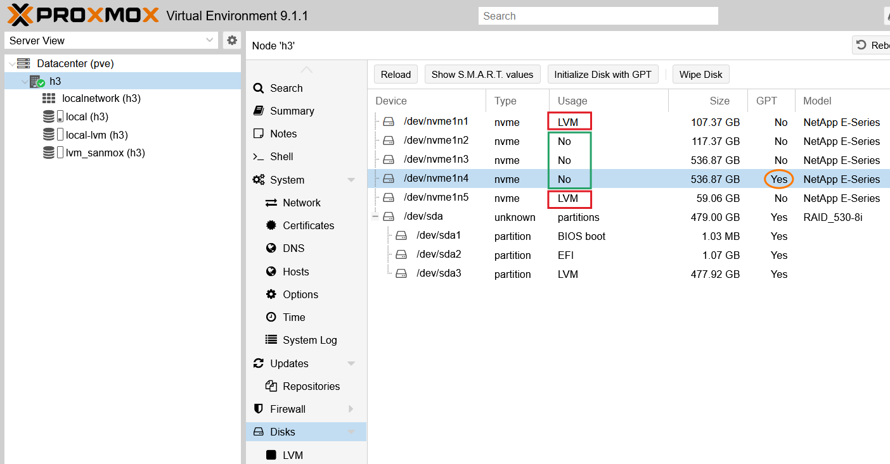
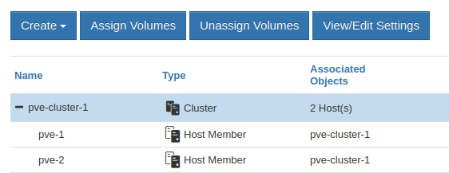
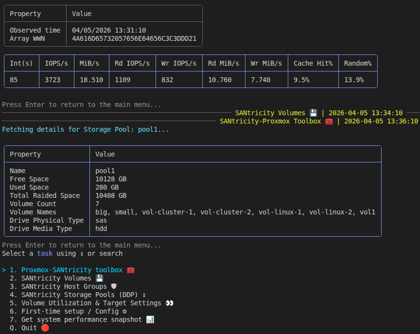

# SANmox - SANtricity - Proxmox VE 9 TUI 

## What is SANmox

Proxmox VE 9's storage plugin approach isn't very attractive. See [this post](https://scaleoutsean.github.io/2026/03/31/proxmox-plugin-netapp-eseries-santricity.html) for more. As a result, I chose to implement a very basic SANtricity LVM plug-in for PVE 9 *and* implement all functionality in a PowerShell TUI (SANmox).

This TUI has the following advantages over Proxmox storage plug-ins:

- Does not require E-Series credentials on PVE nodes
- Uses API to access PVE - less likely to break after PVE updates
- Uses API access to SANtricity and easy to extend as underlying SANtricity PowerShell cmdlets are many
- Leverages SANtricity LVM without any risk or complexity

Although the TUI could work with generic PVE LVMPlugin (and the initial release did), now it should be used only with SANtricity LVM Plugin (`santricity_lvm` found in `./santricity/proxmox_plugin`.

**Requirements:**

- PowerShell 7.6+ on client (any OS that runs PowerShell) with SANmox module
- PVE 9.1 with `santricity_lvm` plugin deployed on PVE nodes that connect to E-Series
- SANtricity 11.9+ with iSCSI or NVMe/RoCE storage interfaces


## SANmox features

- **SANtricity** LUN provisioning lifecycle for SANtricity with PVE 9
  - Create
  - Extend/resize
  - Delete
  - Change major properties (caching, media scan)
- **SANtricity** configuration review
  - Pool details
  - LUN paths
- **PVE** lifecycle for shared storage LVM
  - Create (requires ready-to-use VG on SANtricity volume)
  - Delete
  - Map (requires use of `santricity_lvm` plugin on PVE nodes)
  - Report/list LVM/VG/LUNs

## Installation and configuration

SANmox is **not** meant to be installed on PVE nodes. It is meant to be installed on a management workstation that can reach PVE hosts and SANtricity management IP(s).

- Assuming your workstation is running Debian Trixie, you should be able to use [PowerShell 7.6 LTS](https://github.com/PowerShell/PowerShell/releases/download/v7.6.0/powershell-lts_7.6.0-1.deb_amd64.deb). If you're on other OS, get a recent PowerShell 7.6 or 7.5
- Install PowerShell module [Spectre Console](https://pwshspectreconsole.com/guides/get-started/): `Install-Module PwshSpectreConsole -Scope CurrentUser`
- Clone this entire repo, change directory to `./sanmox`. Copy `sanconfig.json.example` to `sanconfig.json`:
  - `SanApiUri`: SANtricity API endpoint
  - `SanUser`: SANtricity `admin` or `storage` (I haven't tried, but might work fine) account
  - `SanPoolName`: SANtricity storage pool name to use for PVE; it is strongly recommended to use DDP
  - `SanHostGroupName`: SANtricity host group (or standalone host) with all PVE hosts' IQNs/NQNs added to it
  - `PveApiUri`: PVE API IP/FQDN
  - `PveUser`: PVE user + API key name. Example: if the PVE user is `root@pam` and API Token name `wtf`, that means `root@pam!wtf` should be provided here. This is same as API token name when you issue it in PVE datacenter API Token issuing workflow. **Important:** uncheck Privilege Separation when creating the token, or your token will have limited privilege - for example, it will be unable to create datastores. You don't need to use `root@pam` account, but your token must have sufficient privileges. Check the PVE documentation for more.
- Run `./sanmox.ps1`
  - Optional: pass a specific config file with `-Config /full/path/to/sanconfig.cluster-a.json`
  - If `-Config` is not provided, SANmox keeps the existing default behavior and loads `./sanconfig.json` from the same directory as `sanmox.ps1`

Your (encrypted) credentials will be securely prompted for on first launch and optionally stored in:

- Linux/macOS: `~/.sanmox_cred.xml` (SANtricity) and `~/.sanmox_pve_cred.xml` (PVE)
- Windows: `$HOME/.sanmox_cred.xml` and `$HOME/.sanmox_pve_cred.xml` (typically `C:\Users\<username>\`)

**Do not leave your password inside `sanconfig.json`!**

If `PveSecret` is present in the config, SANmox will warn at startup and use it only as a fallback when no encrypted PVE credential has been saved yet. Treat this as a temporary migration aid, not the normal operating mode.

```powershell
PowerShell 7.6.1
PS /home/sean/code/santricity-powershell> Install-Module -Name PwshSpectreConsole
PS /home/sean/code/santricity-powershell> ./sanmox/sanmox.ps1                                        
Please enter password for SANtricity user 'admin' (input hidden): ********
Do you want to save this password securely for future sessions? (Y/n): 

Please enter password/secret for PVE user 'root@pam' (input hidden): ********
Do you want to save this PVE password securely for future sessions? (Y/n): 

# Alternate profile/config example
PS /home/sean/code/santricity-powershell> ./sanmox/sanmox.ps1 -Config /home/sean/configs/sanconfig.cluster-b.json
```

To reset credentials and get prompted to enter them again: `sanmox -resetCredentials`.

## How to use SANmox

Remember to check datastores and disks before making changes to PVE LVMs managed by SANmox. Generally:

- `Usage: LVM` shows a volume is in use (although it may not have anything on it, you should at least remove LVM datastore and VG before deleting this volume from SANtricity). SANmox can do that automatically (`Proxmox-SANtricity Toolbox` > `Remove PVE datastore`), but it's best to not automate these critical moves without verifying datastore status.
- `GPT: Yes` may not mean anything, and I generally don't even use that, but maybe someone else is using this disk.
- `Usage: No` and `GPT: No` is the safest situation. Although this is view from one host. Another PVE host may have a different view, so as always when working with shared storage, make sure before you act.



Create a SANtricity host group for PVE datacenter (cluster) from the UI or other (PowerShell, Python, etc):



Create a SANtricity volume (example: `sanmox`) in **SANtricity Volumes**:


### Create datastore using automated approach

SANmox provides an end-to-end automated workflow from the TUI (from Namespace/LUN creation, to shared LVM creation using the `santricity_lvm` storage plug-in via SSH automation).

How SANmox uses `santricity_lvm` to create and remove datastores:
- Create a volume, map to PVE host(s), e.g. `snmx04`
- Create VG on one of the hosts, e.g. `vg_snmx04`
- Use `pvesm` to add 

```sh
pvesm add santricity_lvm lvm_smx04 \
  --vgname vg_smx04 \
  --array_serial <santricity_chassis_serial> \
  --shared 1 \
  --saferemove 1 \
  --content "images,rootdir" \
  --snapshot-as-volume-chain 1
```

You may perform this workflow by yourself, and use SANmox for less sensitive operations that don't touch PVE datastores, LVMs or VGs.

If you use SANmox for end-to-end automation of PVE 9.1, these commands are executed over SSH (not PVE API), because that's the only way to automate both NVMe/RoCE and iSCSI. Once PVE API starts supporting NVMe/RoCE, we'll be able to switch to using the API. For now, you need tell SANmox what SSH key to use (passwordless or ssh-agent cached password) to get root access to PVE hosts. If you prefer to not let SANmox access PVE hosts, run the PVE side of provisioning manually (rescan, login, create persistent connection (NVMe), create VG, create LVM datastore).

## TUI Menus

They currently look roughly like this.

### Top level

```sh
> 1. Proxmox-SANtricity toolbox 🧰 
  2. SANtricity Volumes 💾         
  3. SANtricity Host Groups 🛡     
  4. Capacity & Target Settings 🕵 
  5. Performance tools 📊          
  6. First-time setup / Config ⚙   
  Q. Quit 🛑      
```

### Proxmox-SANtricity Toolbox

These are generally related to Proxmox, i.e. when PVE already sees, or even uses, SANtricity block devices. Item 5 lets you remove a datastore from PVE (assuming it's empty), and can *optionally* also delete it from E-Series. See the next menu to contrast and compare.

```sh
> 1. View SANtricity LVM Datastores (santricity_lvm) ONLY 👀     
  2. View SANtricity-backed PVE Datastores and Mappings 👀       
  3. View Configured Host Group/Host Disk Identifiers & Paths 👀 
  4. View E-Series Disks from PVE Host Perspective 🖥            
  5. Remove PVE datastore (Optionally deletes SAN volume) 🚮     
  B. Back to main menu 🏠     
```

### SANtricity Volumes 

Unlike in `Proxmox-SANtricity Toolbox`, this is about dealing with SANtricity volumes before they get used by Proxmox. Once they get used by Proxmox, you need to manage them in `Proxmox-SANtricity Toolbox`. As an example, item 3 lets you `Remove SANtricity volume`. But - see in `Proxmox-SANtricity Toolbox` above - you don't want to use this before you make sure the volume is not used by PVE and `View SANtricity LVM Datastores` and `Remove PVE datastore` in the toolbox menu let you take care of that.

```sh
> 1. View SANtricity volumes in pool pool1 👀                     
  2. Create SANtricity volume (auto-map to pool) 🆕               
  3. Remove SANtricity volume (WARNING: Must be emptied first) 🚮 
  4. Edit SANtricity volume properties (resize 🔺 / cache / scan) 
  B. Back to main menu 🏠   
```

### SANtricity Host Groups

That just lists them for you.

```sh
Fetching configured SANtricity Host Group/Host entries...
╭────────────┬───────────────┬───────────────┬──────────────┬───────────┬─────────╮
│ Type       │ Configured    │ Resolved      │ Members      │ Transport │ SA Ctrl │
├────────────┼───────────────┼───────────────┼──────────────┼───────────┼─────────┤
│ Host Group │ kvm-cluster-1 │ kvm-cluster-1 │ node1, node2 │ iscsi     │ No      │
╰────────────┴───────────────┴───────────────┴──────────────┴───────────┴─────────╯
Select a task using ↕ or search    
```

If you need to make changes, it is suggested to do it the way you'd normally do it, because cutting a wrong host (or the entire group) off would cause massive failover fest or unplanned downtime. If you feel comfortable with SANtricity PowerShell modules or other tools (Go CLI, Ansible, etc.), you can also make changes from there.

### Capacity and Target Settings

This shows DDP (that's what's recommended, although you could use classic RAID), DDP utilization by volumes (not datastore utilization, you'd have to query PVE for that and given various complexities, [that's more appropriate for an external tool](https://scaleoutsean.github.io/2026/05/11/proxmox-netapp-eseries-santricity-storage-monitoring.html)) and SANtricity target setting (iSCSI, NVMeoF/RoCE).

```sh
> 1. SANtricity Storage Pools (DDP) ↕        
  2. Volume Utilization & Target Settings 👀 
  B. Back to main menu 🏠         
```

Example:

```sh
╭─────────────────────┬──────────────────────────────────────────────────────────────────────────────────╮
│ Property            │ Value                                                                            │
├─────────────────────┼──────────────────────────────────────────────────────────────────────────────────┤
│ Name                │ pool1                                                                            │
│ Free Space          │ 30760 GB                                                                         │
│ Used Space          │ 208 GB                                                                           │
│ Total Raided Space  │ 30968 GB                                                                         │
│ Volume Count        │ 7                                                                                │
│ Volume Names        │ pve_db1, raid1test, vol-cluster-1, vol-cluster-2, vol-linux-1, vol-linux-2, vol1 │
│ Drive Physical Type │ nvme4k                                                                           │
│ Drive Media Type    │ ssd                                                                              │
```

## Performance Tools

Just like capacity management, these aren't meant to replace your Grafana or whatever. It's to be able to get some idea of WTH is going on without using the browser.

```sh
> 1. Get system performance snapshot (quick) 📈     
  2. Storage Performance Advisor (longer sample) 🧭 
  B. Back to main menu 🏠       
```

Here's a screenshot example of that performance snapshot plus some other stuff.


